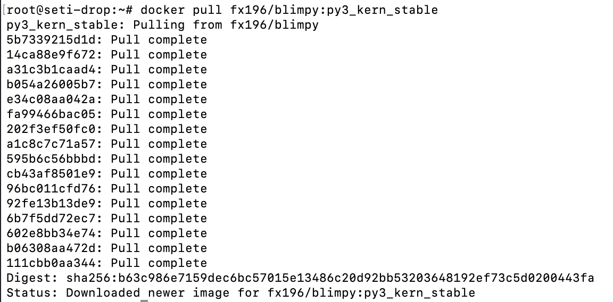
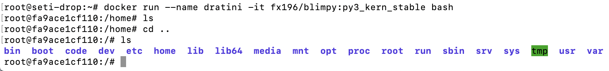
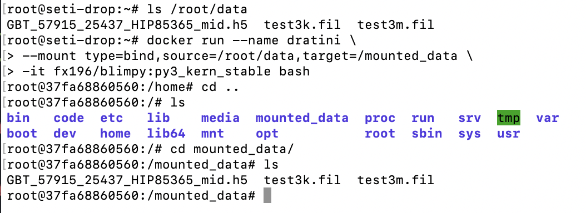
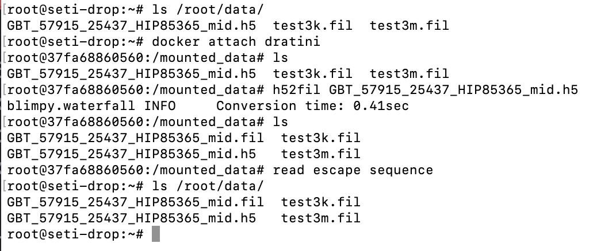
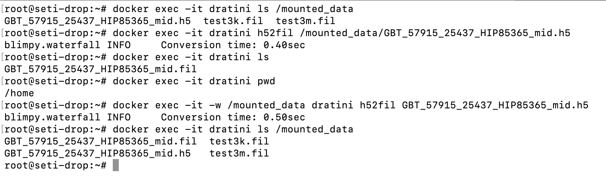

# Using `blimpy` with `docker`

## Quick Start

Docker is a "containerized" service that is similar to a virtual machine. It's lighter than a virtual machine since the docker containers run directly on the host OS instead of on a guest OS.

Docker helps prevent any installation errors or problems with environment settings by building containers which are identical to the ones tested on Travis CI.

### Some Terminology

A **container** is like a remote machine with everything installed and ready to use. You can have bash sessions inside a container.

An **image** is like a blueprint or a frozen state of a system. It tells docker exactly what a container should have.


### Pulling an image
```bash
docker pull <repo>:<tag>
```

Our blimpy images are stored on docker hub, which is basically Github for docker images. *Pulling* an image downloads it to your machine.

Currently, our repo on docker hub is `fx196/blimpy`. You can specify which version of Python you want by using different tags.

For python3, use:

`docker pull fx196/blimpy:py3_kern_stable`

For python2, use:

`docker pull fx196/blimpy:py2_kern_stable`



### Run container from image

```bash
docker run --name <name> -it <repo>:<tag> bash
```

This command takes the image `<repo>:<tag>`, builds a container from it, and opens an interactive bash session inside it.

For example:

`docker run --name dratini -it fx196/blimpy:py3_kern_stable bash`

Will build a container with the python3 version of blimpy that's named `dratini` and connect to it. Think of this as starting up your remote machine and then `ssh`-ing to it.

After the above command, your command line should look like this:


Starting from the second line in the picture, we are inside the container.

Exit the container after running it with ctrl+P then ctrl+Q.

### TLDR

- `docker pull fx196/blimpy:py3_kern_stable` to pull python3 version image
- `docker run --name blimpy_py3 -it fx196/blimpy:py3_kern_stable bash` to start container
- ctrl+P then ctrl+Q to exit container

### After running the container

Continuing with the anology of using a remote machine:

| Remote Machine Command | Docker equivalent | Use | Example |
| ----- | ----- | ----- | ----- |
| exit | ctrl+P then ctrl+Q | disconnect from machine | |
| ssh | docker attach \<name\> | connect to machine | `docker attach dratini`|
| `scp local_file remote:remote_path` | `docker cp local_file name:container_path`| copy from local to remote | `docker cp test.fil dratini:/data`|
| `scp remote:remote_file local_path` | `docker cp name:container_path local_path` | copy from remote to local | `docker cp dratini:/data/test.fil .`

## Advanced

### Bind Mounts

Bind mounts are a faster alternative to copying files into the container. This "binds" a directory on the host machine to a directory in the container. Bind mounting a directory allows the container to read and write data inside that directory.

Let's say we have a directory `/root/data` that contains some `h5` files we want to use. We can bind mount it to a container called `dratini` using:

```bash
docker run --name dratini --mount type=bind,source=/root/data,target=/mounted_data -it fx196/blimpy:py3_kern_stable bash
```

This will create a path `/mounted_data` inside the container, allowing the container to access the contents of `/root/data` by accessing `/mounted_data`.



Changing the contents of `/mounted_data` in the containter will also change the contents of `/root/data` on the host. If we use `h52fil` inside the mounted directory, we can access the result directly on the host machine without needing to use `docker cp`. This is illustrated below:




### Running commands outside the container

You can run commands in the container while on the host machine using `docker exec`.

For example, after starting `dratini` and bind mounting `/root/data` to `/mounted_data`, we can look at the files in `/mounted_data` and use `h52fil` on the `.h5` file inside:



Note that `blimpy` writes the resulting `.fil` file to the working directory, which happens to be `/home` inside the container. We can set the working directory for our command to `/mounted_data` by adding `-w /mounted_data` to our command. The `-w` flag lets us select the working directory.
